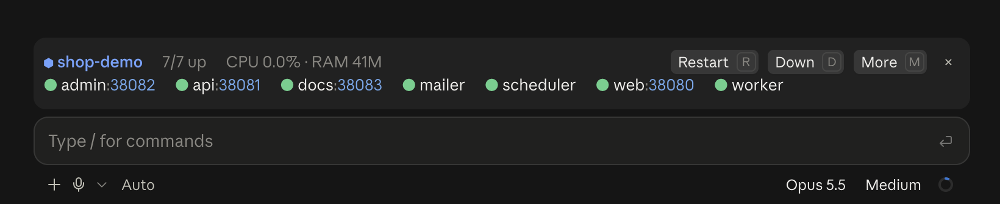
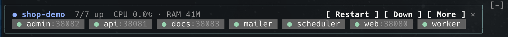
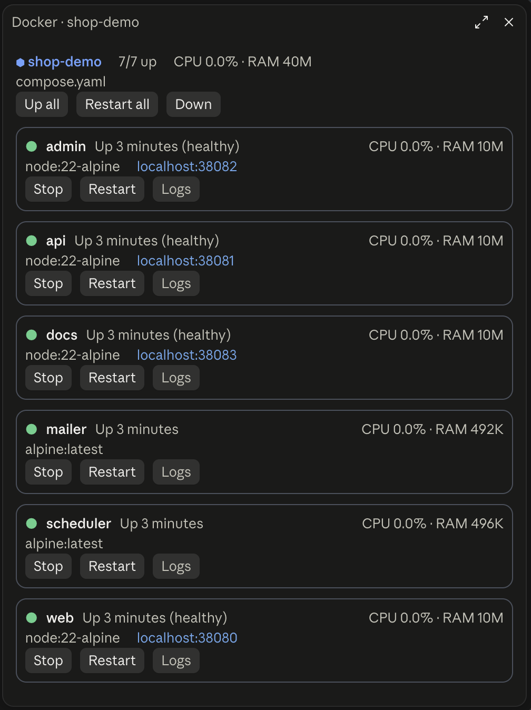

# docker-panel

A [Claude Code](https://claude.com/claude-code) mod that keeps your Docker Compose project in sight: a status band above the prompt with every service's health, a control pane for each container, alerts when a container crashes or runs on stale config, and one-press actions — including handing a crash straight to Claude.

Works in the terminal and in the desktop app's Code tab.







## Features

- **Live status** — row one sums up the project: how many services are up, total CPU and RAM, the current problem and the actions. Row two has one chip per Compose service: running, healthy, starting, unhealthy, stopped, exited with code, restart count, and what an action on it is doing right now.
- **Control pane** — **More** opens a pane beside the transcript with stack-wide actions and a card per service: state, image, published ports as `localhost` links, CPU and memory, its own Start / Stop / Restart / Rebuild buttons and its logs on demand. While an action runs on a service, its card and chip say so (`◐ stopping…`). The pane scrolls when there are many services and keeps names whole when it is narrow.
- **Event-driven** — follows `docker compose events`, with a 15-second fallback poll. No compose file in the session directory, no band.
- **Crash alerts** — a toast when a service exits non-zero, crash-loops or turns unhealthy. **Ask Claude** puts the failure and its logs into the prompt.
- **Stale config detection** — compares each running container's compose config hash with the current file, and the image build time with the Dockerfile. **Rebuild & up** rebuilds just the stale services.
- **Context-aware actions** — `▶` Up / `⚒` Up --build when nothing runs; `↻` Restart / `■` Down when healthy; Ask Claude / Restart for the failing service. **More** opens the control pane and reads **Less** while it is open.

## Requirements

- Claude Code with function-hook mods (an early-access API; tested on 2.1.288)
- Docker Engine with the Compose plugin (`docker compose`)

## Install

From this repository's marketplace:

```
/plugin marketplace add adayarabov/docker-panel
/plugin install docker-panel@docker-panel
```

Or load a local checkout for one session:

```bash
claude --plugin-dir /path/to/docker-panel/plugins/docker-panel
```

## Usage

The band appears on its own in any directory with `compose.yaml`, `compose.yml`, `docker-compose.yaml` or `docker-compose.yml`.

| Command | What it does |
| --- | --- |
| `/docker` or `/docker status` | Service list with ports and problems |
| `/docker up [svc]` | `docker compose up -d` |
| `/docker down` | `docker compose down` (volumes are kept) |
| `/docker restart [svc]` | `docker compose restart` |
| `/docker rebuild [svc]` | `up -d --build` for the named or stale services |
| `/docker more` / `/docker logs [svc]` | Opens the control pane, with `svc`'s logs unfolded (the last 40 lines into the transcript where no pane fits) |
| `/docker start <svc>` / `stop <svc>` | Start or stop one service |
| `/docker-panel hide` / `show` | Hide or bring back the band; remembered across sessions |
| `/docker-panel use <dir>` | Follow the compose project in another directory (a monorepo's `docker/`, say); remembered per session directory, `use .` goes back |

In the desktop app the `×` in the band's corner hides it too; in the terminal, Claude Code's own `[-]` (or `ctrl+x ctrl+a`) collapses it for the moment. Band buttons have hotkeys once the band holds focus (`ctrl+x tab` or a click).

## Try it

[`examples/shop-demo`](examples/shop-demo) is a seven-service stack built only from `node:22-alpine` and `alpine`:

```bash
cd examples/shop-demo
docker compose up -d
claude
```

Set `CRASH=1` in its `.env` and run `docker compose up -d api` to watch a crash loop; edit any service's `command` to see the stale-config state.

## Limitations

- Stale image detection looks at the Dockerfile only, not the rest of the build context.
- Mouse clicks in the terminal need Claude Code's fullscreen mode; commands and hotkeys work everywhere.
- Function-hook mods are early access: the API may change between Claude Code releases.

## Development

The plugin lives in [`plugins/docker-panel`](plugins/docker-panel). Opening Claude Code in this repository loads it through the `.claude/skills/docker-panel` symlink, and saving a file hot-reloads it.

```bash
claude plugin validate plugins/docker-panel
claude plugin test plugins/docker-panel
tsc -p plugins/docker-panel   # after Claude Code has loaded the plugin once
```

How the mod works inside, its tests and its layout are described in [plugins/docker-panel/README.md](plugins/docker-panel/README.md).

See [CONTRIBUTING.md](CONTRIBUTING.md).

## License

[MIT](LICENSE)
